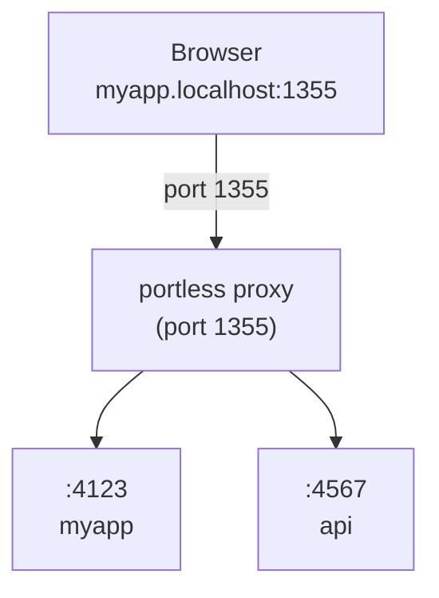

# portless

Replace port numbers with stable, named .localhost URLs. For humans and agents.

```diff
- "dev": "next dev"              # http://localhost:3000
+ "dev": "portless myapp next dev"  # http://myapp.localhost:1355
```

## Quick Start

```bash
# Install
npm install -g portless

# Start the proxy (once, no sudo needed)
portless proxy start

# Run your app (auto-starts the proxy if needed)
portless myapp next dev
# -> http://myapp.localhost:1355
```

> The proxy auto-starts when you run an app. You can also start it explicitly with `portless proxy start`.

## Why

Local dev with port numbers is fragile:

- **Port conflicts** -- two projects default to the same port and you get `EADDRINUSE`
- **Memorizing ports** -- was the API on 3001 or 8080?
- **Refreshing shows the wrong app** -- stop one server, start another on the same port, and your open tab now shows something completely different
- **Monorepo multiplier** -- every problem above scales with each service in the repo
- **Agents test the wrong port** -- AI coding agents guess or hardcode the wrong port, especially in monorepos
- **Cookie and storage clashes** -- cookies set on `localhost` bleed across apps on different ports; localStorage is lost when ports shift
- **Hardcoded ports in config** -- CORS allowlists, OAuth redirect URIs, and `.env` files all break when ports change
- **Sharing URLs with teammates** -- "what port is that on?" becomes a Slack question
- **Browser history is useless** -- your history for `localhost:3000` is a jumble of unrelated projects

Portless fixes all of this by giving each dev server a stable, named `.localhost` URL that both humans and agents can rely on.

## Usage

```bash
# Basic
portless myapp next dev
# -> http://myapp.localhost:1355

# Subdomains
portless api.myapp pnpm start
# -> http://api.myapp.localhost:1355

portless docs.myapp next dev
# -> http://docs.myapp.localhost:1355
```

### In package.json

```json
{
  "scripts": {
    "dev": "portless myapp next dev"
  }
}
```

The proxy auto-starts when you run an app. Or start it explicitly: `portless proxy start`.

## How It Works



1. **Start the proxy** -- auto-starts when you run an app, or start explicitly with `portless proxy start`
2. **Run apps** -- `portless <name> <command>` assigns a free port and registers with the proxy
3. **Access via URL** -- `http://<name>.localhost:1355` routes through the proxy to your app

Apps are assigned a random port (4000-4999) via the `PORT` environment variable. Most frameworks (Next.js, Vite, etc.) respect this automatically.

## HTTP/2 + HTTPS

Enable HTTP/2 for faster dev server page loads. Browsers limit HTTP/1.1 to 6 connections per host, which bottlenecks dev servers that serve many unbundled files (Vite, Nuxt, etc.). HTTP/2 multiplexes all requests over a single connection.

```bash
# Start with HTTPS/2 -- generates certs and trusts them automatically
portless proxy start --https

# First run prompts for sudo once to add the CA to your system trust store.
# After that, no prompts. No browser warnings.

# Make it permanent (add to .bashrc / .zshrc)
export PORTLESS_HTTPS=1
portless proxy start    # HTTPS by default now

# Use your own certs (e.g., from mkcert)
portless proxy start --cert ./cert.pem --key ./key.pem

# If you skipped sudo on first run, trust the CA later
sudo portless trust
```

## Commands

```bash
portless <name> <cmd> [args...]  # Run app at http://<name>.localhost:1355
portless list                    # Show active routes
portless trust                   # Add local CA to system trust store

# Disable portless (run command directly)
PORTLESS=0 pnpm dev              # Bypasses proxy, uses default port
# Also accepts PORTLESS=skip

# Proxy control
portless proxy start             # Start the proxy (port 1355, daemon)
portless proxy start --https     # Start with HTTP/2 + TLS
portless proxy start -p 80       # Start on port 80 (requires sudo)
portless proxy start --foreground  # Start in foreground (for debugging)
portless proxy stop              # Stop the proxy

# Options
-p, --port <number>              # Port for the proxy (default: 1355)
                                 # Ports < 1024 require sudo
--https                          # Enable HTTP/2 + TLS with auto-generated certs
--cert <path>                    # Use a custom TLS certificate (implies --https)
--key <path>                     # Use a custom TLS private key (implies --https)
--no-tls                         # Disable HTTPS (overrides PORTLESS_HTTPS)
--foreground                     # Run proxy in foreground instead of daemon

# Environment variables
PORTLESS_PORT=<number>           # Override the default proxy port
PORTLESS_HTTPS=1                 # Always enable HTTPS
PORTLESS_STATE_DIR=<path>        # Override the state directory

# Info
portless --help                  # Show help
portless --version               # Show version
```

## State Directory

Portless stores its state (routes, PID file, port file) in a directory that depends on the proxy port:

- **Port < 1024** (sudo required): `/tmp/portless` -- shared between root and user processes
- **Port >= 1024** (no sudo): `~/.portless` -- user-scoped, no root involvement

Override with the `PORTLESS_STATE_DIR` environment variable if needed.

## Requirements

- Node.js 20+
- macOS or Linux
