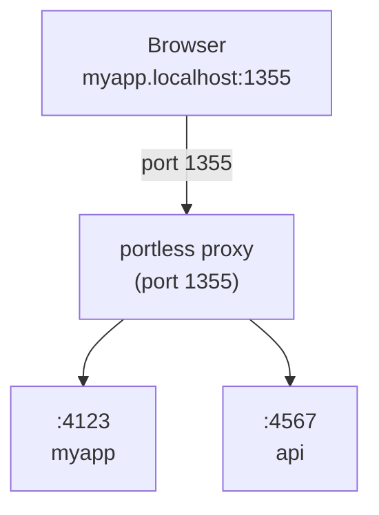

# portless

Replace port numbers with stable, named .localhost URLs. For humans and agents.

```diff
- "dev": "next dev"              # http://localhost:3000
+ "dev": "portless run next dev"   # http://myapp.localhost:1355
```

## Quick Start

```bash
# Install
npm install -g portless

# Run your app (auto-starts the proxy if needed)
portless run next dev
# -> http://<project>.localhost:1355

# Or specify a name explicitly
portless myapp next dev
# -> http://myapp.localhost:1355
```

> The proxy auto-starts when you run an app. You can also start it explicitly with `portless proxy start`.

## Why

Local dev with port numbers is fragile:

- **Port conflicts** -- two projects default to the same port and you get `EADDRINUSE`
- **Memorizing ports** -- was the API on 3001 or 8080?
- **Refreshing shows the wrong app** -- stop one server, start another on the same port, and your open tab now shows something completely different
- **Monorepo multiplier** -- every problem above scales with each service in the repo
- **Agents test the wrong port** -- AI coding agents guess or hardcode the wrong port, especially in monorepos
- **Cookie and storage clashes** -- cookies set on `localhost` bleed across apps on different ports; localStorage is lost when ports shift
- **Hardcoded ports in config** -- CORS allowlists, OAuth redirect URIs, and `.env` files all break when ports change
- **Sharing URLs with teammates** -- "what port is that on?" becomes a Slack question
- **Browser history is useless** -- your history for `localhost:3000` is a jumble of unrelated projects

Portless fixes all of this by giving each dev server a stable, named `.localhost` URL that both humans and agents can rely on.

## Usage

```bash
# Auto-infer name from package.json / git / directory
portless run next dev
# -> http://<project>.localhost:1355

# Explicit name
portless myapp next dev
# -> http://myapp.localhost:1355

# Subdomains
portless api.myapp pnpm start
# -> http://api.myapp.localhost:1355

portless docs.myapp next dev
# -> http://docs.myapp.localhost:1355

# Wildcard subdomains (no extra registration needed)
# Any subdomain of a registered route routes automatically:
#   tenant1.myapp.localhost:1355  -> myapp
#   tenant2.myapp.localhost:1355  -> myapp
```

### Git Worktrees

`portless run` automatically detects git worktrees. When you're in a linked worktree, the branch name is prepended as a subdomain so each worktree gets its own URL without any config changes:

```bash
# Main worktree (main/master branch) -- no prefix, works normally
portless run next dev
# -> http://myapp.localhost:1355

# Linked worktree on branch "fix-ui" -- branch name becomes a prefix
portless run next dev
# -> http://fix-ui.myapp.localhost:1355

# Linked worktree on branch "feature/auth" -- uses last segment
portless run next dev
# -> http://auth.myapp.localhost:1355
```

This means you can put `portless run` in your `package.json` once and it just works everywhere -- the main checkout uses the plain name, and each worktree gets a unique subdomain. No `--force` needed, no name collisions.

### In package.json

```json
{
  "scripts": {
    "dev": "portless run next dev"
  }
}
```

The proxy auto-starts when you run an app. Or start it explicitly: `portless proxy start`.

## How It Works


```mermaid
flowchart TD
    Browser["Browser\nmyapp.localhost:1355"]
    Proxy["portless proxy<br>(port 1355)"]
    App1[":4123\nmyapp"]
    App2[":4567\napi"]

    Browser -->|port 1355| Proxy
    Proxy --> App1
    Proxy --> App2
```

1. **Start the proxy** -- auto-starts when you run an app, or start explicitly with `portless proxy start`
2. **Run apps** -- `portless <name> <command>` assigns a free port and registers with the proxy
3. **Access via URL** -- `http://<name>.localhost:1355` routes through the proxy to your app

Apps are assigned a random port (4000-4999) via the `PORT` and `HOST` environment variables. Most frameworks (Next.js, Express, Nuxt, etc.) respect these automatically. For frameworks that ignore `PORT` (Vite, Astro, React Router, Angular, Expo, React Native), portless auto-injects the correct `--port` and `--host` flags.

## HTTP/2 + HTTPS

Enable HTTP/2 for faster dev server page loads. Browsers limit HTTP/1.1 to 6 connections per host, which bottlenecks dev servers that serve many unbundled files (Vite, Nuxt, etc.). HTTP/2 multiplexes all requests over a single connection.

```bash
# Start with HTTPS/2 -- generates certs and trusts them automatically
portless proxy start --https

# First run prompts for sudo once to add the CA to your system trust store.
# After that, no prompts. No browser warnings.

# Make it permanent (add to .bashrc / .zshrc)
export PORTLESS_HTTPS=1
portless proxy start    # HTTPS by default now

# Use your own certs (e.g., from mkcert)
portless proxy start --cert ./cert.pem --key ./key.pem

# If you skipped sudo on first run, trust the CA later
sudo portless trust
```

On Linux, `portless trust` supports Debian/Ubuntu, Arch, Fedora/RHEL/CentOS, and openSUSE (via `update-ca-certificates` or `update-ca-trust`).

## Commands

```bash
portless run <cmd> [args...]     # Infer name from project, run through proxy
portless <name> <cmd> [args...]  # Run app at http://<name>.localhost:1355
portless alias <name> <port>     # Register a static route (e.g. for Docker)
portless alias <name> <port> --force  # Overwrite an existing route
portless alias --remove <name>   # Remove a static route
portless list                    # Show active routes
portless trust                   # Add local CA to system trust store
portless hosts sync              # Add routes to /etc/hosts (fixes Safari)
portless hosts clean             # Remove portless entries from /etc/hosts
portless completion <bash|zsh|fish>  # Print shell completion script

# Disable portless (run command directly)
PORTLESS=0 pnpm dev              # Bypasses proxy, uses default port
# Also accepts PORTLESS=skip

# Proxy control
portless proxy start             # Start the proxy (port 1355, daemon)
portless proxy start --https     # Start with HTTP/2 + TLS
portless proxy start -p 80       # Start on port 80 (requires sudo)
portless proxy start --foreground  # Start in foreground (for debugging)
portless proxy stop              # Stop the proxy

# Options
-p, --port <number>              # Port for the proxy (default: 1355)
                                 # Ports < 1024 require sudo
--https                          # Enable HTTP/2 + TLS with auto-generated certs
--cert <path>                    # Use a custom TLS certificate (implies --https)
--key <path>                     # Use a custom TLS private key (implies --https)
--no-tls                         # Disable HTTPS (overrides PORTLESS_HTTPS)
--foreground                     # Run proxy in foreground instead of daemon
--app-port <number>              # Use a fixed port for the app (skip auto-assignment)
--force                          # Override a route registered by another process
--name <name>                    # Use <name> as the app name (bypasses subcommand dispatch)
--                               # Stop flag parsing; everything after is passed to the child

# Injected into child processes
PORT                             # Ephemeral port the child should listen on
HOST                             # Always 127.0.0.1
PORTLESS_URL                     # Public URL (e.g. http://myapp.localhost:1355)

# Configuration
PORTLESS_PORT=<number>           # Override the default proxy port
PORTLESS_APP_PORT=<number>       # Use a fixed port for the app (same as --app-port)
PORTLESS_HTTPS=1|true            # Always enable HTTPS
PORTLESS_SYNC_HOSTS=1            # Auto-sync /etc/hosts when routes change
PORTLESS_STATE_DIR=<path>        # Override the state directory

# Info
portless --help                  # Show help
portless completion --help       # Show completion command help
portless run --help              # Show help for a specific subcommand
portless --version               # Show version
```

> **Reserved names:** `run`, `alias`, `hosts`, `list`, `trust`, `proxy`, and `completion` are subcommands and cannot be used as app names directly. Use `portless run <cmd>` to infer the name from your project, or `portless --name <name> <cmd>` to force any name including reserved ones.

## Shell Completion

```bash
# Bash (~/.bashrc)
source <(portless completion bash)

# Zsh (~/.zshrc)
eval "$(portless completion zsh)"

# Fish
mkdir -p ~/.config/fish/completions
portless completion fish > ~/.config/fish/completions/portless.fish
```

## State Directory

Portless stores its state (routes, PID file, port file) in a directory that depends on the proxy port:

- **Port < 1024** (sudo required): `/tmp/portless` -- shared between root and user processes
- **Port >= 1024** (no sudo): `~/.portless` -- user-scoped, no root involvement

Override with the `PORTLESS_STATE_DIR` environment variable if needed.

## Development

This repo is a pnpm workspace monorepo using [Turborepo](https://turbo.build). The publishable package lives in `packages/portless/`.

```bash
pnpm install          # Install all dependencies
pnpm build            # Build all packages
pnpm test             # Run tests
pnpm test:coverage    # Run tests with coverage
pnpm test:watch       # Run tests in watch mode
pnpm lint             # Lint all packages
pnpm typecheck        # Type-check all packages
pnpm format           # Format all files with Prettier
```

## Safari / DNS

`.localhost` subdomains auto-resolve to `127.0.0.1` in Chrome, Firefox, and Edge. Safari relies on the system DNS resolver, which may not handle `.localhost` subdomains on all configurations.

If Safari can't find your `.localhost` URL:

```bash
# Add current routes to /etc/hosts (requires sudo)
sudo portless hosts sync

# Clean up later
sudo portless hosts clean
```

To auto-sync `/etc/hosts` whenever routes change, set `PORTLESS_SYNC_HOSTS=1` and start the proxy with sudo:

```bash
export PORTLESS_SYNC_HOSTS=1
sudo portless proxy start
```

## Proxying Between Portless Apps

If your frontend dev server (e.g. Vite, webpack) proxies API requests to another portless app, make sure the proxy rewrites the `Host` header. Without this, the proxy sends the **original** Host header, causing portless to route the request back to the frontend in an infinite loop.

**Vite** (`vite.config.ts`):

```ts
server: {
  proxy: {
    "/api": {
      target: "http://api.myapp.localhost:1355",
      changeOrigin: true,  // Required: rewrites Host header to match target
      ws: true,
    },
  },
}
```

**webpack-dev-server** (`webpack.config.js`):

```js
devServer: {
  proxy: [{
    context: ["/api"],
    target: "http://api.myapp.localhost:1355",
    changeOrigin: true,  // Required: rewrites Host header to match target
  }],
}
```

Portless detects this misconfiguration and responds with `508 Loop Detected` along with a message pointing to this fix.

## Requirements

- Node.js 20+
- macOS or Linux
