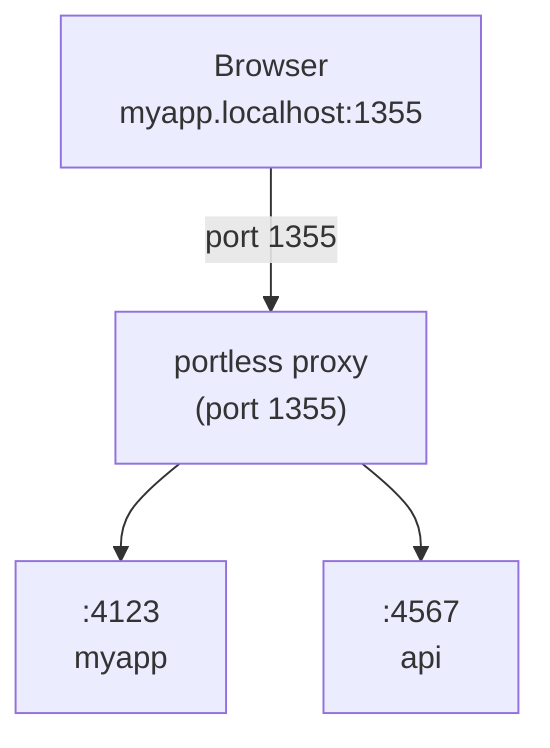

# portless

Replace port numbers with stable, named .localhost URLs for local development. For humans and agents.

```diff
- "dev": "next dev"                  # http://localhost:3000
+ "dev": "portless run next dev"     # https://myapp.localhost
```

## Install

```bash
npm install -g portless
```

> Install globally. Do not add as a project dependency or run via npx.

## Run your app

```bash
portless myapp next dev
# -> http://myapp.localhost:1355

# HTTPS on port 443 (default with --https)
sudo portless proxy start --https
portless myapp next dev
# -> https://myapp.localhost

# HTTP on port 80
sudo portless proxy start -p 80
portless myapp next dev
# -> http://myapp.localhost
```

The proxy auto-starts when you run an app. A random port (4000--4999) is assigned via the `PORT` environment variable. Most frameworks (Next.js, Express, Nuxt, etc.) respect this automatically. For frameworks that ignore `PORT` (Vite, Astro, React Router, Angular), portless auto-injects `--port` and `--host` flags.

## Use in package.json

```json
{
  "scripts": {
    "dev": "portless run next dev"
  }
}
```

## Subdomains

Organize services with subdomains:

```bash
portless api.myapp pnpm start
# -> http://api.myapp.localhost:1355

portless docs.myapp next dev
# -> http://docs.myapp.localhost:1355
```

Wildcard subdomain routing: any subdomain of a registered route routes to that app automatically (e.g. `tenant1.myapp.localhost:1355` routes to the `myapp` app without extra registration).

## Git Worktrees

`portless run` automatically detects git worktrees. In a linked worktree, the branch name is prepended as a subdomain so each worktree gets its own URL without any config changes:

```bash
# Main worktree -- no prefix
portless run next dev   # -> http://myapp.localhost:1355

# Linked worktree on branch "fix-ui"
portless run next dev   # -> http://fix-ui.myapp.localhost:1355
```

Put `portless run` in your `package.json` once and it works everywhere -- the main checkout uses the plain name, each worktree gets a unique subdomain. No collisions, no `--force`.

## Custom TLD

By default, portless uses `.localhost` which auto-resolves to `127.0.0.1` in most browsers. If you prefer a different TLD (e.g. `.test`), use `--tld`:

```bash
sudo portless proxy start --https --tld test
portless myapp next dev
# -> https://myapp.test
```

The proxy auto-syncs `/etc/hosts` when started with sudo, so `.test` domains resolve correctly.

Recommended: `.test` (IANA-reserved, no collision risk). Avoid `.local` (conflicts with mDNS/Bonjour) and `.dev` (Google-owned, forces HTTPS via HSTS).

## How it works


```mermaid
flowchart TD
    Browser["Browser\nmyapp.localhost:1355"]
    Proxy["portless proxy\n(port 1355)"]
    App1[":4123\nmyapp"]
    App2[":4567\napi"]

    Browser -->|port 1355| Proxy
    Proxy --> App1
    Proxy --> App2
```

1. **Start the proxy** -- auto-starts when you run an app, or start explicitly with `portless proxy start`
2. **Run apps** -- `portless <name> <command>` assigns a free port and registers with the proxy
3. **Access via URL** -- `http://<name>.localhost:1355` routes through the proxy to your app

## HTTP/2 + HTTPS

Enable HTTP/2 for faster dev server page loads. Browsers limit HTTP/1.1 to 6 connections per host, which bottlenecks dev servers that serve many unbundled files (Vite, Nuxt, etc.). HTTP/2 multiplexes all requests over a single connection.

```bash
# Start with HTTPS/2 -- generates certs and trusts them automatically
# Defaults to port 443 (requires sudo)
sudo portless proxy start --https

# First run prompts for sudo once to add the CA to your system trust store.
# After that, no prompts. No browser warnings.

# Make it permanent (add to .bashrc / .zshrc)
export PORTLESS_HTTPS=1
sudo portless proxy start    # HTTPS on port 443 by default

# Use your own certs (e.g., from mkcert)
portless proxy start --cert ./cert.pem --key ./key.pem

# If you skipped sudo on first run, trust the CA later
sudo portless trust
```

On Linux, `portless trust` supports Debian/Ubuntu, Arch, Fedora/RHEL/CentOS, and openSUSE (via `update-ca-certificates` or `update-ca-trust`).

## Commands

```bash
portless run <cmd> [args...]     # Infer name from project, run through proxy
portless <name> <cmd> [args...]  # Run app at http://<name>.localhost:1355
portless alias <name> <port>     # Register a static route (e.g. for Docker)
portless alias <name> <port> --force  # Overwrite an existing route
portless alias --remove <name>   # Remove a static route
portless list                    # Show active routes
portless trust                   # Add local CA to system trust store
portless hosts sync              # Add routes to /etc/hosts (fixes Safari)
portless hosts clean             # Remove portless entries from /etc/hosts

# Disable portless (run command directly)
PORTLESS=0 pnpm dev              # Bypasses proxy, uses default port

# Proxy control
portless proxy start             # Start the proxy (port 1355, daemon)
portless proxy start --https     # Start with HTTP/2 + TLS (port 443)
portless proxy start -p 80       # Start on port 80 (requires sudo)
portless proxy start --foreground  # Start in foreground (for debugging)
portless proxy stop              # Stop the proxy
```

### Options

```
-p, --port <number>              Port for the proxy (default: 1355, or 443 with --https)
--https                          Enable HTTP/2 + TLS (default port: 443)
--cert <path>                    Use a custom TLS certificate (implies --https)
--key <path>                     Use a custom TLS private key (implies --https)
--no-tls                         Disable HTTPS (overrides PORTLESS_HTTPS)
--foreground                     Run proxy in foreground instead of daemon
--tld <tld>                      Use a custom TLD instead of .localhost (e.g. test)
--app-port <number>              Use a fixed port for the app (skip auto-assignment)
--force                          Override a route registered by another process
--name <name>                    Use <name> as the app name
```

### Environment variables

```
# Configuration
PORTLESS_PORT=<number>           Override the default proxy port
PORTLESS_APP_PORT=<number>       Use a fixed port for the app (same as --app-port)
PORTLESS_HTTPS=1|true            Always enable HTTPS
PORTLESS_TLD=<tld>               Use a custom TLD (e.g. test; default: localhost)
PORTLESS_SYNC_HOSTS=0            Disable auto-sync of /etc/hosts (enabled by default)
PORTLESS_STATE_DIR=<path>        Override the state directory

# Injected into child processes
PORT                             Ephemeral port the child should listen on
HOST                             Always 127.0.0.1
PORTLESS_URL                     Public URL (e.g. https://myapp.localhost)
```

> **Reserved names:** `run`, `alias`, `hosts`, `list`, `trust`, and `proxy` are subcommands and cannot be used as app names directly. Use `portless run <cmd>` to infer the name from your project, or `portless --name <name> <cmd>` to force any name including reserved ones.

## Safari / DNS

`.localhost` subdomains auto-resolve to `127.0.0.1` in Chrome, Firefox, and Edge. Safari relies on the system DNS resolver, which may not handle `.localhost` subdomains on all configurations.

If Safari can't find your `.localhost` URL:

```bash
sudo portless hosts sync    # Add current routes to /etc/hosts
sudo portless hosts clean   # Clean up later
```

The proxy auto-syncs `/etc/hosts` whenever routes change (when started with sudo). To disable auto-sync, set `PORTLESS_SYNC_HOSTS=0`.

## Proxying Between Portless Apps

If your frontend dev server (e.g. Vite, webpack) proxies API requests to another portless app, make sure the proxy rewrites the `Host` header. Without this, portless routes the request back to the frontend in an infinite loop.

**Vite** (`vite.config.ts`):

```ts
server: {
  proxy: {
    "/api": {
      target: "http://api.myapp.localhost:1355",
      changeOrigin: true,
      ws: true,
    },
  },
}
```

**webpack-dev-server** (`webpack.config.js`):

```js
devServer: {
  proxy: [{
    context: ["/api"],
    target: "http://api.myapp.localhost:1355",
    changeOrigin: true,
  }],
}
```

Portless detects this misconfiguration and responds with `508 Loop Detected` along with a message pointing to this fix.

## Development

This repo is a pnpm workspace monorepo using [Turborepo](https://turbo.build). The publishable package lives in `packages/portless/`.

```bash
pnpm install          # Install all dependencies
pnpm build            # Build all packages
pnpm test             # Run tests
pnpm test:coverage    # Run tests with coverage
pnpm lint             # Lint all packages
pnpm typecheck        # Type-check all packages
pnpm format           # Format all files with Prettier
```

## Requirements

- Node.js 20+
- macOS or Linux
